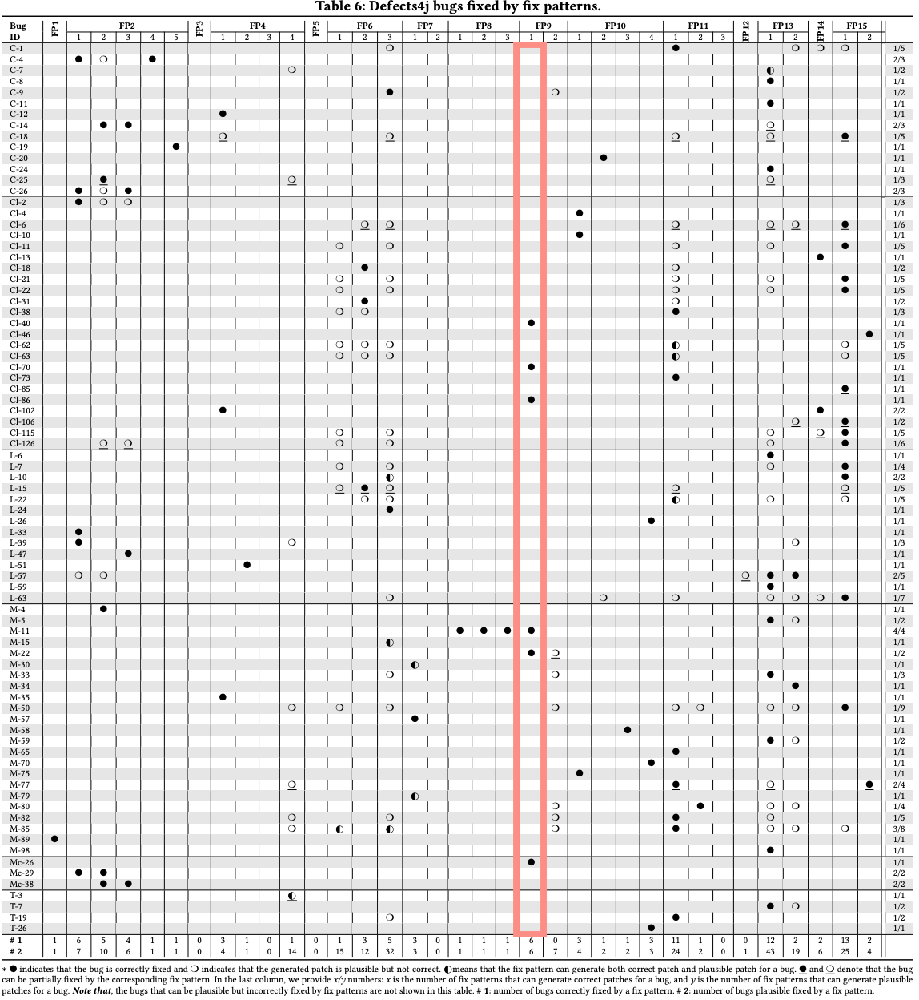

For our evaluation, we generated the baseline clusters out of information extracted from the TBar [publication](https://dl.acm.org/doi/10.1145/3293882.3330577).
For each fix pattern in the TBar taxonomy, we made a cluster of the fixed Defects4j bugs.

E.g., the correct fixes generated by TBar by applying FP9.1 pattern (Closure-40, Closure-70, Closure-86, Math-11, Math-22 and Mockito-26) make one cluster:

When multiple fixes were generated for the same bug, we chose the one most similar to the human-written fix and discarded the rest.
Additionally, we decided to exclude three fixes (Lang-24, Math-4, Math-58) because they were not available online and we did not have access to their code modifications.
As a result, the number of baseline clusters was 23 and the total number of TBar fixes 47.

